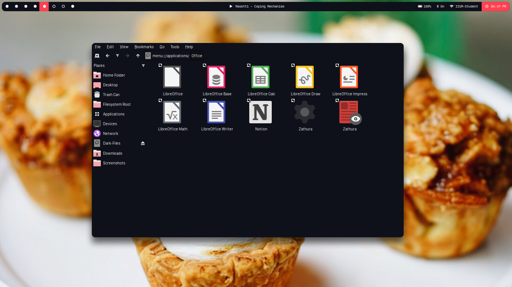
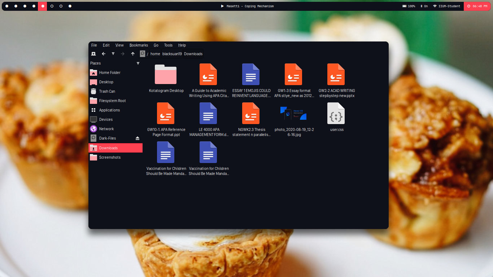

## Installation

- `git clone https://github.com/material-ocean/Icons`
- `cp -r Materil-Ocean $HOME/.local/share/icons`
- set icon pack to material ocean from settings

## Preview

## License

Licenseed Under GNU's GPL3, checkout [LICENCE](./LICENCE) for more information
